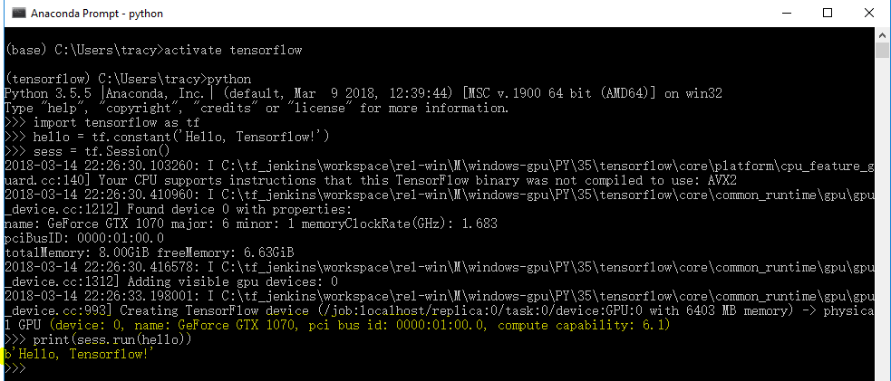

# Capstone project DogVsCat

为什么选择了这个项目？刚从P5转战过来，这个项目与P5（狗狗分类）非常类似，但是比P5要求又高出很多作为练手的项目还是不错的。当然其他的Capstone项目我打算在毕业之后继续选做2个，一个是自然语言处理的文档归类项目以及Rossmann销售预测项目。项目本身取自Kaggle是一个已经close的项目，项目的需求也比较明确和简单，输入“彩色图片”，输出“是猫还是狗”，一个监督学习的二分类的问题。

# 环境的搭建

项目训练集一共有25000张图片解压后594m，测试集一共有12500张图片解压后有296m。考虑到本地机器性能还算不错，选择在本地搭建环境而非AWS。机器配置大概如下

```
CPU : Inter i7-6700K
Memory : 16G
GPU : Nvidia GeForce GTX 1070 8G
OS : Win 10 64bit
```

根据[Tensorflow官方](https://tensorflow.google.cn/)给出的文档在本地搭建GPU的运行环境。首先下载并安装CUDA TookKit 9.0，然后下载对应版本的cuDNN 7.0，解压后根据[NVIDIA官方说明](http://docs.nvidia.com/cuda/cuda-installation-guide-microsoft-windows/ "Markdown")将解压后的cuDNN的文件拷贝到指定目录中。注意，这里CUDA和cuDNN的版本一定要按照官方要求来按照！！

```
安装完成后可以通过命令：nvcc -V 来检查下是否安装成功，安装成功的话会输出以下命令
nvcc: NVIDIA (R) Cuda compiler driver
Copyright (c) 2005-2017 NVIDIA Corporation
Built on Fri_Sep__1_21:08:32_Central_Daylight_Time_2017
Cuda compilation tools, release 9.0, V9.0.176
```

考虑到会使用jupyter notebook，所以选择用Anaconda，再Nivida的环境安装完成后，继续安装Anaconda的环境，脚本在Tensorflow官方文档都已经详细给出
```
1. 创建python的环境 
   1.1) conda create -n tensorflow pip python=3.5
2. 其次安装 Tensorflow的GPU版本
   2.1）activate tensorflow
   2.2）pip install --ignore-installed --upgrade tensorflow-gpu
3. 最后按照官方提示跑一个hello world的应用来校验安装是否成功
   >>> import tensorflow as tf
   >>> hello = tf.constant('Hello, TensorFlow!')
   >>> sess = tf.Session()
   >>> print(sess.run(hello))
```

运行之后如下图，成功的输出了Hello, TensorFlow！并且显示出了显卡的信息，GPU环境已经准备完毕



当然考虑到我们需要读取图片，构建CNN，操作矩阵等等。因此还需要安装一些额外的工具包。

```
conda install opencv 图片处理
conda install keras  CNN构建
conda install numpy  矩阵，数组
conda install matplot 画图？
```

至此环境准备完毕


# 数据准备

训练集一共25000张猫和狗的图片，测试集一共12500张猫和狗的图片。解压后训练集猫的图片从cat.0.jpg一直到cat.12499.jpg，狗的图片从dog.0.jpg一直到dog.12499.jpg。测试集的数据从1.jpg一直到12500.jpg。因为会用到Keras的ImageDataGenerator，这里需要对训练集的数据做些简单预处理。因为是在windows环境，简单粗暴的直接在train下面创建2个文件夹dog和cat，然后直接将dog和cat图片剪切到对应的文件夹中。如果是在Linux建议使用Symbol Link这样不用移动任何一张图片。
