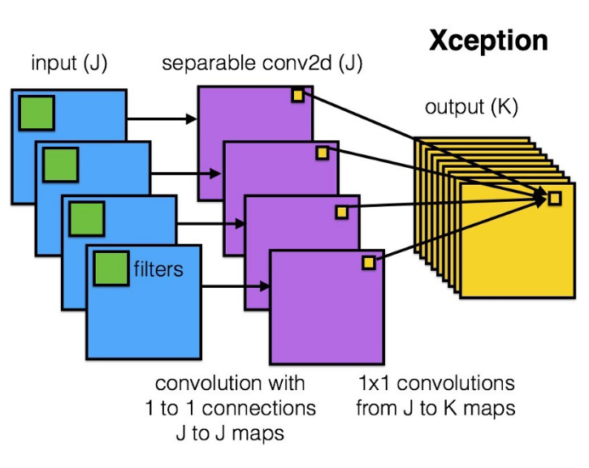

# Capstone project DogVsCat

为什么选择了这个项目？刚从P5转战过来，这个项目与P5（狗狗分类）非常类似，但是比P5要求又高出很多作为练手的项目还是不错的。当然其他的Capstone项目我打算在毕业之后继续选做2个，一个是自然语言处理的文档归类项目以及Rossmann销售预测项目。项目本身取自Kaggle是一个已经close的项目，项目的需求也比较明确和简单，输入“彩色图片”，输出“是猫还是狗”，一个监督学习的二分类的问题。

# 环境的搭建

项目训练集一共有25000张图片解压后594m，测试集一共有12500张图片解压后有296m。考虑到本地机器性能还算不错，选择在本地搭建环境而非AWS。机器配置大概如下

```
CPU : Inter i7-6700K
Memory : 16G
GPU : Nvidia GeForce GTX 1070 8G
OS : Win 10 64bit
```

根据[Tensorflow官方](https://tensorflow.google.cn/)给出的文档在本地搭建GPU的运行环境。首先下载并安装CUDA TookKit 9.0，然后下载对应版本的cuDNN 7.0。根据[NVIDIA官方说明](http://docs.nvidia.com/cuda/cuda-installation-guide-microsoft-windows/ "Markdown")将解压后的cuDNN的文件拷贝到指定目录中。注意，这里CUDA和cuDNN的版本一定要和官方要求的一致！！

```
安装完成后可以通过命令：nvcc -V 来检查下是否安装成功，安装成功的话会输出以下命令
nvcc: NVIDIA (R) Cuda compiler driver
Copyright (c) 2005-2017 NVIDIA Corporation
Built on Fri_Sep__1_21:08:32_Central_Daylight_Time_2017
Cuda compilation tools, release 9.0, V9.0.176
```

考虑到会使用jupyter notebook，所以选择用Anaconda，再Nivida的环境安装完成后，继续安装Anaconda的环境，脚本在Tensorflow官方文档都已经详细给出
```
1. 创建python的环境 
   1.1) conda create -n tensorflow pip python=3.5
2. 其次安装 Tensorflow的GPU版本
   2.1）activate tensorflow
   2.2）pip install --ignore-installed --upgrade tensorflow-gpu
3. 最后按照官方提示跑一个hello world的应用来校验安装是否成功
   >>> import tensorflow as tf
   >>> hello = tf.constant('Hello, TensorFlow!')
   >>> sess = tf.Session()
   >>> print(sess.run(hello))
```

运行之后如下图，成功的输出了Hello, TensorFlow！并且显示出了显卡的信息，GPU环境准备完毕！


当然考虑到我们需要读取图片，构建CNN，操作矩阵等等。因此还需要安装一些额外的工具包。注意Keras最好使用pip的命令来安装，这里我踩了一个坑。用conda install keras后，自动给我安装了一个cpu版本的tensorflow从而覆盖掉了GPU版本的tensorflow。

```
pip install --ignore-installed --upgrade jupyter notebook
pip install --ignore-installed --upgrade keras
pip install --ignore-installed --upgrade pillow
conda install opencv
```

至此环境准备完毕


# 数据准备

解压后训练集一共有25000张猫和狗的图片，测试集一共12500张猫和狗的图片。猫的图片：cat.0.jpg-cat.12499.jpg，狗的图片：dog.0.jpg-dog.12499.jpg。测试集：1.jpg-12500.jpg。因为会用到Keras的ImageDataGenerator，这里需要对训练集的数据做些简单预处理。因为是在windows环境，可以使用windows的bash脚本来进行操作。

```
首先运行CMD，然后cd到train文件夹中,然后依次执行以下脚本
md cat
md dog
move cat*jpg cat\
move dog*jpg dog\
```

# 模型选择

Capstone中给出了以下几个模型

* [LeNet](http://yann.lecun.com/exdb/publis/pdf/lecun-01a.pdf) 1998
* [AlexNet](https://papers.nips.cc/paper/4824-imagenet-classification-with-deep-convolutional-neural-networks.pdf) 12
* [VGGNet](https://arxiv.org/abs/1409.1556) 14.09
* [GoogLeNet](https://arxiv.org/abs/1409.4842) 14.09
* [ResNet](https://arxiv.org/abs/1512.03385) 15.12
* [Inception v3](https://arxiv.org/abs/1512.00567) 15.12
* [Inception v4](https://arxiv.org/abs/1602.07261) 16.02
* [Xception](https://arxiv.org/abs/1610.02357) 16.10
* [ResNeXt](https://arxiv.org/abs/1611.05431) 16.11

打算选择4个模型分别为 VGGNet，ResNet，Inception v3，Xception，而且这4个模型Keras都已全部集成了。没直接看论文，看下其他人的介绍[ImageNet: VGGNet, ResNet, Inception, and Xception with Keras](https://www.pyimagesearch.com/2017/03/20/imagenet-vggnet-resnet-inception-xception-keras/)感觉写的也挺不错的，我来稍微做个总结：

- VGGNet，模型比较简单，只用多个了3x3的conv filter，max-pooling，2层全连接层(每层4096个nodes)及最后的argmax层。VGGNet主要有2个缺点，一个训练起来很慢，非常耗时。另外一个是模型weights很多，导致模型很大，训练时也会占用更多的磁盘和带宽。VGG16大约533MB，VGG19大约574MB。VGG相对下面几个网络来说已经用的比较少了。

- ResNet，也叫残差网络，诞生于一个美丽而简单的观察：为什么非常深度的网络在增加更多层时会表现得更差？作者将这些问题归结成了一个单一的假设：直接映射是难以学习的。而且他们提出了一种修正方法：不再学习从 x 到 H(x) 的基本映射关系，而是学习这两者之间的差异，也就是「残差（residual）」,假设残差为 F(x)=H(x)-x，那么现在我们的网络不会直接学习 H(x) 了，而是学习 F(x)+x。这就带来了你可能已经见过的著名 ResNet（残差网络）模块。ResNet由多个残差模块组成，结果是好得出奇。ResNet的模型比VGG小许多，大概只有100MB左右。


- Inception，是GoogleNet的改版，V3，V4是Google后来起的不同的版本名称。这个网络的特点在课程中有介绍。在同一层同时采用3x3，1x1，5x5的Filter及一个3x3的max pooling，最后将这些不同Filter的结果组装，传输至下一层。如果说ResNet深，那么Inception就是宽。Inception的模型比VGGNet和ResNet都要小，大概只有96MB。


- Xception，Xception的意思是extreme inception，而且正如其名字表达的那样，它将 Inception 的原理推向了极致。它的假设是：「跨通道的相关性和空间相关性是完全可分离的，最好不要联合映射它们。」Xception 的作者也是 Keras 的作者。Francois Chollet 是真正的大神 ：）



# 训练模型

选择了好模型并且大概的了解了下几个模型以及它们之间的区别，下面让我们开始训练模型！请移步[训练代码](dog_vs_cat.ipynb)来查看相关步骤及代码。
