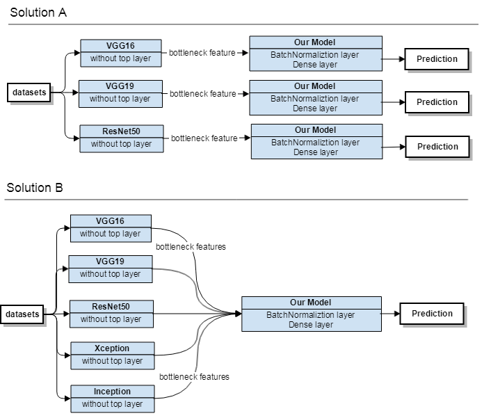

# Domain Background
Image recognition or image classification is a problem in vision science as well as in computer science. The task is to assign a image to one or more classes. This may be done by manually or algorithmically and the images to be classified may contain different object, different size and different color. Images may classified according to edges, corners, blobs and ridge(1).

This project will focus on algorithmically method, exactly machine learning algorithms which are widely used in image recognition and image classification. There are many classification algorithms such as Decision Tree, KNN, Navies Bayes and Neural Network, each of these models have their own advantages and disadvantages. The algorithm will be used is convolutional neural network(CNN or ConvNet). It is a deep, feed-forward artificial neural network that has successfully been applied to analyzing visual imagery(2).

There are many public images online for classification, here, i will apply classification algorithms on a Kaggle project dogs vs cats(3), which contains 25000 images in train set and 12500 images in test set. The image will be classified according to their features.

# Problem Statement
The classification of dogs vs cats is a supervised classification problem, there are 2 categories, each of the image is only belong to one category, the goal is to use CNN to assign each image to the correct category.

Because training CNN from scratch is time consuming. I will download highly matured CNN models without top layer as base models and use these base models to extract bottleneck features using our datasets. Based on these features we can build our own CNN models and train my models. Finally I will validate the performance on my own models.

In this project I will use TensorFlow(4) as backend and Keras(5) as high level API to build CNN. To save time I will choose VGG16, VGG9, ResNet, InceptionV3, Xception as base CNN models because these models are all embedded in Keras Application API(6).

# Datasets and Inputs
The datasets can be downloaded from Kaggle directly(7). Kaggle provided 3 files, train.zip for training data, test.zip for testing data and a submission file in csv format. The train set contains 2 categories images, 12500 images for dog and 12500 images for cat. But test set don't provide any category, i only can use it when i want to generate a submission file based on our prediction via test set. Which means i only can know test result after submission. Hence i use another datasets, Oxford Pet datasets(8) as testing datasets which can run test and see result locally. The Oxford Pet datasets contains 7390 images in total, 2400 images for cats, 4990 images for dogs.

As i will use Keras as high level API it is a good practice to use Keras image preprocceing APIs like ImageDataGenerator(9) to generate batches of tensor images. First, i need to split train data into 2 sub-folders, test data into 1 sub-folder and Oxford Pet datasets also into 2 sub-folders. Then feed these images to ImageDataGenerator by folder path and image size to get tensor images as our input tensor to CNNs.

# Solution Statement
As we build our model based on bottleneck features extract from VGG, ResNet, Xception and Inception. We can simply build our own model just contain several simple layers to do classification. Then we use input tensor generate by Keras to train our model. There are 2 solutions, first is only use one model's bottleneck features to train our model. Second is combine all the models' bottleneck features to train our model and even can integrate with other learning algorithm. According to Kaggle winner interview(10) the second solution will be better than the first one. I will try both solutions in this project.

# Benchmark Model
As i mentioned there are 2 solutions, i would like to use first solution to generate benchmark models to compare with second solution. According to the Kaggle winner interview the second solution is slightly better than the first one. Here i will consider three factors:
- bias: the ideal model should assign each testing images to correct category, i suppose the second solution accuracy is a little higher than the first one
- variance: the model performance should not change a lot on different dataset, we need to avoid overfitting. The difference between train and test set should not exceed 5%.
- time: the second solution should take more time as it rely on more models than the first solution

# Evaluation Metrics
As it is a binary classification problem with ten thousands of examples, i will use two metrics here: accuracy and running time.
- accuracy: the proportion of correct label we made on our training dataset. Ideally it should be 100%.(n means the number of samples, yi means the value predict by model, yi hat means the ground truth value, I equal to 1 when yi equals to yi hat otherwise I equal to 0)

- time: the time that the algorithm takes to do classification, a good algorithm should predict fast as end user can't wait for a long time

Above all a well performance model should have high accuracy and a reasonable running time.

# Project Design
The architecture design is as below, the first solution will simply transfer learning from only one model at a time and integrate with our own model. The second solution will combine all the bottleneck features and then integrate with our own model. Our model will only contains two layers, BacthNormailization layer for preventing overfitting and a dense layer do classification. However this is only a proposed architecture the detail may still be changed during development and tuning.

# References

(1) Computer vision: https://en.wikipedia.org/wiki/Feature_detection_(computer_vision)

(2) Convolutional neural network: https://en.wikipedia.org/wiki/Convolutional_neural_network

(3) Kaggle Dogs vs Cats: https://www.kaggle.com/c/dogs-vs-cats-redux-kernels-edition

(4) TensorFlow: https://tensorflow.google.cn/

(5) Keras: https://keras.io/

(6) Keras Applications: https://keras.io/applications/

(7) Dogs vs Cats Datasets: https://www.kaggle.com/c/dogs-vs-cats-redux-kernels-edition/data

(8) Oxford Pet Datasets: http://www.robots.ox.ac.uk/%7Evgg/data/pets/

(9) Keras ImageDataGenerator: https://keras.io/preprocessing/image/

(10) Kaggle Winner Interview: http://blog.kaggle.com/2017/04/03/dogs-vs-cats-redux-playground-competition-winners-interview-bojan-tunguz/
