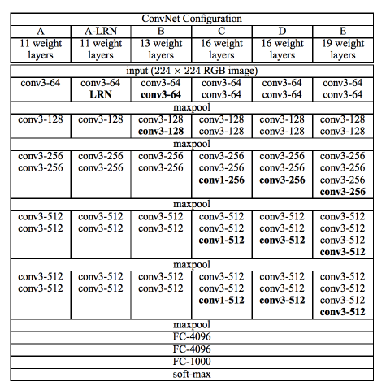

# 猫狗分类项目报告

## 定义
### 项目概述
图像识别或图像分类是属于视觉科学和电脑科学领域的一个问题。这类问题的目的是需要将图片分类至一个或多个类别当中。这个问题可以通过人工手动或借助算法来完成，这些图片可能包含了不同的物体，图片的大小可能不一致，颜色上也千差万别。图片仍可以根据它们所包含的边缘（edges），角（corners），区域（blobs）和脊（ridge）来做分类[1]。

本项目将会采用广泛使用的机器学习算来进行图片识别以及图片分类。机器学习包含许多的分类算法比如，决策树，KNN，朴素贝叶斯和神经网络等等，每个模型都有它们各自的优缺点。这里我们将采用卷积神经网络（简称CNN或ConvNet）来做图片分类。卷积神经网络是一个兼具深度和高识别率的神经网络，已经成功应用于图像识别领域。

本项目将基于Kaggle的一个竞赛项目Dogs vs Cats[2]来进行图像识别。这个项目包含了25000张的训练集图片以及12500张的测试集图片。这些图片将被划分到猫或狗的一个分类中。

### 问题陈述
猫狗识别的项目属于监督学习中的分类问题，本项目中一共有2个类别，每一张图片只属于其中一个类别，项目的目标是利用CNN将图片划分到它们正确的类别中。因为从零开始训练一个卷积网络需要花费大量的时间和资源，这里会使用已经身经百战的CNN模型，并利用这些模型导出数据集的深度特征。然后基于这些深度特征来训练自定义的模型，并在最后验证自定的模型。

### 评价指标
TODO

## 分析
### 数据的探索
项目的数据集能直接从Kaggle[3]上下载。Kaggle一共提供了3个文件，train.zip是训练集，test.zip是测试集以及一个csv格式的submission文件。训练集包含了2个类别的图片，猫和狗的图片各12500张。测试集包含了12500图片。训练集下数据的通过文件名提供了标签，文件名的格式是{类别}.{序号}.jpg，比如猫的图片名称为cat.1.jpg，狗的图片名称为dog.1.jpg。因此我们可以根据文件名，将其进行分类。而测试集的数据中并没有提供标签，文件名的格式是{序号}.jpg，比如1.jpg或2.jpg。同时数据集中的图片大小都是不一致的，需要在后续的步骤中处理这个问题。下面展示的是的训练集和测试集的部分数据。

训练集中猫的图片

训练集中狗的图片

测试集中的图片

### 算法和技术
项目使用VGG[4]，ResNet[5]，InceptionV3[6]，Xception[7]作为项目的基础模型，这些基础模型的概览如下：

- VGG: VGG网络架构最早由Simonyan和Zisserman在2014年提出，VGG网络架构比较简单，遵循基本卷积网络的原型布局，一系列卷积层、最大池化层和激活层，最后还有一些全连接的分类层。如下图。

而VGG16和VGG19中的16和19分别代表了权重的层数，如下图的D列及E列。VGGNet主要有2个缺点，一个训练起来很慢，非常耗时。另外一个是模型weights很多，导致模型很大，训练时也会占用更多的磁盘和带宽。VGG16大约533MB，VGG19大约574MB。

- ResNet：也叫残差网络，诞生于一个美丽而简单的观察：为什么非常深度的网络在增加更多层时会表现得更差？作者将这些问题归结成了一个单一的假设：直接映射是难以学习的。而且他们提出了一种修正方法：不再学习从 x 到 H(x) 的基本映射关系，而是学习这两者之间的差异，也就是「残差（residual）」,假设残差为 F(x)=H(x)-x，那么现在我们的网络不会直接学习 H(x) 了，而是学习 F(x)+x。这就带来了你可能已经见过的著名 ResNet（残差网络）模块（如下图）。ResNet的模型比VGG小许多，大概只有100MB左右。

- Inception：第一版叫做GoogleNet，V3，V4是不同的版本名称。这个网络的特点在同一层同时采用3x3，1x1，5x5的Filter及一个3x3的max pooling来提取多个特征，再将这些不同特征组装。如下图：

如果ResNet是为了更深，那么 Inception 家族就是为了更宽。这种模型架构的信息密度更大了，这就带来了一个突出的问题：计算成本大大增加。所以作者使用 1×1 卷积来执行降维，一个 1×1 卷积一次仅查看一个值，但在多个通道上，它可以提取空间信息并将其压缩到更低的维度，如下图。Inception的模型比VGGNet和ResNet都要小，大概只有96MB。 

- Xception：Xception的意思是extreme inception，而且正如其名字表达的那样，它将 Inception 的原理推向了极致。它的假设是：「跨通道的相关性和空间相关性是完全可分离的，最好不要联合映射它们。」Xception 不再只是将输入数据分割成几个压缩的数据块，而是为每个输出通道单独映射空间相关性，然后再执行 1×1 的深度方面的卷积来获取跨通道的相关性，如下图。Xception的模型最小大概只有89MB。 

项目中使用谷歌的TensorFlow[8]作为神经网络的平台，使用Keras[9]的API来构建并训练CNN。这些基础模型在Kearas的Application API[10]中已经全部集成了。项目中我会基于这些的模型来进行迁移学习，并构建一个简单自定义的模型来进行学习和预测。项目中一共采用了2个方案，方案1是基于单个模型的迁移学习，即只采用一个模型导出的深度特征来进行训练；方案2是基于当前所有模型的迁移学习，即合并所有模型的深度特征来进行训练。

### 探索性可视化
TODO 可视化深度特征

### 基准模型
这里项目的要求是达到Kaggle的排行榜的前10%，所以本项目的要求是在测试集上的LogLoss表现要低于0.06127。

### 数据预处理
项目中一共对数据做了2次预处理，第一次因为flow_from_directory API的要求，对训练集中的2类图片进行了一个分类。根据图片的文件名称将2猫和狗的图片分别放在cat和dog的子文件夹中。同时把测试集的数据全部移动到一个子文件夹中。第二次是在导出深度特征导时，利用Lambda函数对输入的图片全部加了一个model.preproccess的预处理操作。比如VGG16，用的是vgg16.preprocess_input方法，而Xception用的是xception.preprocess_input方法（实际上调用的都是同一个方法，xception和inception指定了后台只能是TensorFlow）这样做的目的是将我们的0-255的RGB值缩小至-1到1的范围，好处是使得模型可以更快的收敛，缩短训练时间。

### 执行过程
在使用基础模型进行迁移学习之前，首先使用Keras的图片预处理API ImageDataGenerator[11]中的方法flow_from_directory加载数据集。因此需要将训练集划分到2个子文件夹中，猫的图片放入cat的文件夹中，狗的图片放入dog文件夹中，测试集全部划分到1个子文件夹中。然后用flow_from_directory的参数target size来调整图片的大小，因为不同的CNN需要的输入的图片大小会有所区别，比如VGG和ResNet要求的图片大小为（224,224）而Xception和Inception需要的图片大小为（299,299）。再使用flow_from_directory读取图片后，调用model的方法predict_generator来进行预测。因为模型是没有包含toplayer的，所以得到会是所有训练集基于当前模型的一个深度特征。为了方便调试，这里把深度特征作为数组以文件的方式保存在本地。

在成功导出了深度特征之后，其次项目需要自定义一个模型来进行迁移学习。自定义模型一共只包含了2层，第一层为BatcNormalization层，目的是为了防止过拟合。第二层为Dense层，激活函数为sigmod，目的是为了做最后的分类。构建完模型后，还需要调用model的compile方法来编译模型。编译模型时，我传递了3个参数，第一个是optimizer代表的是优化器，项目中使用的是Adam[12],这是一款常见的优化器，特点是计算效率较高，对内存要求比较少，默认参数的超参数大多数情况下基本够用了。第二个是loss代表的是损失函数，因为是二分类我使用的是binary_crossentropy。第三个是metrics代表的是衡量指标，这里可以传递的是数组，可以有1个或多个指标，我使用的是['accuracy']。

模型编译完成后就可以开始训练模型，这里不需手动将训练集划分为训练数据和验证数据，Keras的Model API[13]提供一个训练模型的方法fit。而fit中提供了一个参数validation_split可以自动帮助我们来划分训练数据和验证数据。比如validation_split = 0.2时，代表80%的数据用于训练，而剩下20%数据用于验证。最后当模型训练完成后，使用测试集的深度特征作为输入，利用model的predict方法来进行预测。将最终结果写入到需要提交的csv文件当中，提交至Kaggle。

项目中我训练了以下场景，并记录了以下数据：
- 基于VGG16的迁移学习的模型200代，一共耗时175.38秒，训练集的最高准确率可以到达0.9897，验证集的最高准确率可以到达0.9744。训练集的最低loss为0.0310，测试集的最低loss为0.0685。
- 基于VGG19的迁移学习模型，训练了200代，一共耗时171.04秒，训练集的最高准确率可以到达0.9908，验证集的最高准确率可以到达0.9754。训练集的最低loss为0.0298，测试集的最低loss为0.0601。
- 基于ResNet50的迁移学习模型，训练了50代，训练一共耗时46.07秒，训练集的最高准确率可以到达0.9948，验证集的最高准确率可以到达0.9838。训练集的最低loss为0.0181，测试集的最低loss为0.0453。
- 基于InceptionV3的迁移学习模型，训练了20代，训练一共耗时20.74秒，训练集的最高准确率可以到达0.9932，验证集的最高准确率可以到达0.9930。训练集的最低loss为0.0232，测试集的最低loss为0.0266。
- 基于Xception的迁移学习，训练了20代，训练一共耗时23.11秒，训练集的最高准确率可以到达0.9946，验证集的最高准确率可以到达0.9932。训练集的最低loss为0.0200，测试集的最低loss为0.0253。
- 基于所有模型的迁移学习，训练了50代，训练一共耗时67.65秒，训练集的最高准确率可以到达0.9954，验证集的最高准确率可以到达0.9940。训练集的最低loss为0.0162，测试集的最低loss为0.0203。
从训练记录来看基于所有模型的迁移学习的准确率是最高的，loss也是最低的。

### 完善
项目中一共完善了2个地方来提升了模型得表现及最终得评分。

- 输出结果完善：Kaggle官方使用的Logloss来进行评估，当预测结果错误的时候Logloss会出现无穷大的情况，这样会使得Logloss计算出比较大的值，从而降低排名。所以我们这里对预测值做了一个区间限制[0.005-0.995]。做完限制后Logloss降低的非常明显。比如基于VGG16迁移学习的模型，在没有对Logloss最大最小值做限制时，在测试集上的Logloss为0.10158，做了限制后降低到了0.08130，整整降低了0.02028；

- 模型训练完善：模型使用的优化器是Adam，刚开始得时候直接使用了Adam的默认超参数来训练，所有模型只训练10次，然后进行评估，发现这样的评估分数并不是十分的理想。于是决定增加训练次数。但是当训练次数超过10次以后，所有模型在验证集的loss上都会出现明显的抖动，一会高，一会低，而不是持续的降低。推测原因是，深度特征都是基于高度成熟的基础模型导出的，提升空间有限，Adma优化器默认的学习速度在这个场景下还是偏高了。于是调整了所有模型的超参数learning rate并且适当的增加了训练次数。所有模型都得到不同程度得提升，比如基于VGG16进行迁移学习的模型，测试集的Logloss从0.08130再次提升到了0.07051，提升了0.01079。

### 模型的评价与验证
在这一部分，你需要对你得出的最终模型的各种技术质量进行详尽的评价。最终模型是怎么得出来的，为什么它会被选为最佳需要清晰地描述。你也需要对模型和结果可靠性作出验证分析，譬如对输入数据或环境的一些操控是否会对结果产生影响（敏感性分析sensitivity analysis）。一些需要考虑的问题：
- _最终的模型是否合理，跟期待的结果是否一致？最后的各种参数是否合理？_
- _模型是否对于这个问题是否足够稳健可靠？训练数据或输入的一些微小的改变是否会极大影响结果？（鲁棒性）_
- _这个模型得出的结果是否可信？_

模型评估，基于测试集，依次用以上模型做了预测之后，将结果按照Kaggle的格式要求生成一份csv文件，将文件提交至Kaggle后，得到以下评估结果（如下图）。其中表现最好的是方案2，采用所有模型的特征并进行迁移学习的自定义模型，得分为0.04128，可以排在1314中得第19名。表现最差的是仅仅对VGG16单个模型进行迁移学的自定义模型。

    

### 合理性分析
在这个部分，你需要利用一些统计分析，把你的最终模型得到的结果与你的前面设定的基准模型进行对比。你也分析你的最终模型和结果是否确确实实解决了你在这个项目里设定的问题。你需要考虑：
- _最终结果对比你的基准模型表现得更好还是有所逊色？_
- _你是否详尽地分析和讨论了最终结果？_
- _最终结果是不是确确实实解决了问题？_

## V. 项目结论
_（大概 1-2 页）_

### 结果可视化

在这一部分，你需要用可视化的方式展示项目中需要强调的重要技术特性。至于什么形式，你可以自由把握，但需要表达出一个关于这个项目重要的结论和特点，并对此作出讨论。一些需要考虑的：
- _你是否对一个与问题，数据集，输入数据，或结果相关的，重要的技术特性进行了可视化？_
- _可视化结果是否详尽的分析讨论了？_
- _绘图的坐标轴，标题，基准面是不是清晰定义了？_

- 深度特征导出，项目里基于当前的训练集和测试集一共导出了5个模型的深度特征,每个文件都包括了训练集和测试集深度特征，详情如下：

    |模型名称|总耗时（单位：秒）|深度特征文件大小（单位：MB）|
    | ------ | -----:|-----:|
    | VGG16    | 205.36 | 73.3 |
    | VGG19    | 232.02 | 73.3 |
    | ResNet50 | 210.49 | 293 |
    | InceptionV3 | 274.99 | 293|
    | Xception    | 416.50 | 293|

  
   
  
   
  
   
  
  
  
  
  

### 对项目的思考
在这一部分，你需要从头到尾总结一下整个问题的解决方案，讨论其中你认为有趣或困难的地方。从整体来反思一下整个项目，确保自己对整个流程是明确掌握的。需要考虑：
- _你是否详尽总结了项目的整个流程？_
- _项目里有哪些比较有意思的地方？_
- _项目里有哪些比较困难的地方？_
- _最终模型和结果是否符合你对这个问题的期望？它可以在通用的场景下解决这些类型的问题吗？_

### 需要作出的改进
在这一部分，你需要讨论你可以怎么样去完善你执行流程中的某一方面。例如考虑一下你的操作的方法是否可以进一步推广，泛化，有没有需要作出变更的地方。你并不需要确实作出这些改进，不过你应能够讨论这些改进可能对结果的影响，并与现有结果进行比较。一些需要考虑的问题：
- _是否可以有算法和技术层面的进一步的完善？_
- _是否有一些你了解到，但是你还没能够实践的算法和技术？_
- _如果将你最终模型作为新的基准，你认为还能有更好的解决方案吗？_

----------
** 在提交之前， 问一下自己... **

- 你所写的项目报告结构对比于这个模板而言足够清晰了没有？
- 每一个部分（尤其**分析**和**方法**）是否清晰，简洁，明了？有没有存在歧义的术语和用语需要进一步说明的？
- 你的目标读者是不是能够明白你的分析，方法和结果？
- 报告里面是否有语法错误或拼写错误？
- 报告里提到的一些外部资料及来源是不是都正确引述或引用了？
- 代码可读性是否良好？必要的注释是否加上了？
- 代码是否可以顺利运行并重现跟报告相似的结果？

引用
[1] Wiki page, Feature detection:en.wikipedia.org/wiki/Feature_detection_(computer_vision)

[2] Kaggle Project Dogs vs Cats:www.kaggle.com/c/dogs-vs-cats-redux-kernels-edition

[3] Dogs vs Cats Datasets: www.kaggle.com/c/dogs-vs-cats-redux-kernels-edition/data

[4] Karen Simonyan, Andrew Zisserman. Very Deep Convolutional Networks for Large-Scale Image Recognition. arXiv:1409.1556, 2014

[5] Kaiming He, Xiangyu Zhang, Shaoqing Ren, Jian Sun. Deep Residual Learning for Image Recognition. arXiv:1512.03385, 2015

[6] Christian Szegedy, Vincent Vanhoucke, Sergey Ioffe, Jonathon Shlens, Zbigniew Wojna. Rethinking the Inception Architecture for Computer Vision. arXiv:1512.00567, 2015

[7] François Chollet. Xception: Deep Learning with Depthwise Separable Convolutions. arXiv:1610.02357, 2016

[9] TensorFlowofficial site:tensorflow.google.cn

[9] Kerasofficial site:keras.io

[10] Keras applicationsintroduction:keras.io/applications/

[11] Keras ImageDataGenerator introduction:keras.io/preprocessing/image/

[12] Diederik Kingma, Jimmy Ba. Adam: A Method for Stochastic Optimization. arXiv:1412.6980, 2014

[13] Keras model API introduction: keras.io/models/model/

[14] Kaggle Team, Dogs vs. Cats Redux Playground Competition, Winner's Interview
